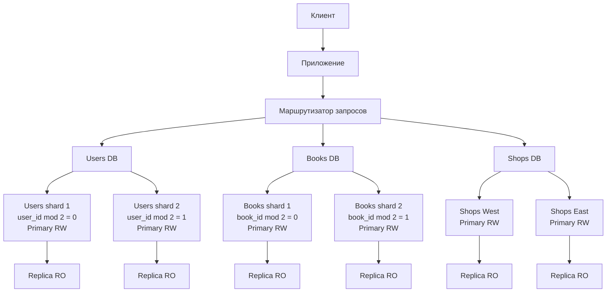

# Домашнее задание к занятиям «Репликация и масштабирование»
---

### Задание 1

Выполните конфигурацию master-slave репликации, примером можно пользоваться из лекции.

*Приложите скриншоты конфигурации, выполнения работы: состояния и режимы работы серверов.*

### Решение:


---

### Задание 2

Разработайте план для выполнения горизонтального и вертикального шаринга базы данных. База данных состоит из трёх таблиц: 

- пользователи, 
- книги, 
- магазины (столбцы произвольно). 

Опишите принципы построения системы и их разграничение или разбивку между базами данных.

*Пришлите блоксхему, где и что будет располагаться. Опишите, в каких режимах будут работать сервера.* 


## Задание 2

Для базы данных предлагается совместное использование вертикального и горизонтального шардинга.

### Структура таблиц

Таблица пользователей:

```sql
CREATE TABLE users (
    user_id BIGINT PRIMARY KEY,
    full_name VARCHAR(255) NOT NULL,
    email VARCHAR(255) NOT NULL,
    region_id INT NOT NULL,
    created_at TIMESTAMP DEFAULT CURRENT_TIMESTAMP
);
```

Таблица книг:

```sql
CREATE TABLE books (
    book_id BIGINT PRIMARY KEY,
    title VARCHAR(255) NOT NULL,
    author VARCHAR(255) NOT NULL,
    genre VARCHAR(100),
    price DECIMAL(10,2) NOT NULL
);
```

Таблица магазинов:

```sql
CREATE TABLE shops (
    shop_id BIGINT PRIMARY KEY,
    name VARCHAR(255) NOT NULL,
    region_id INT NOT NULL,
    address VARCHAR(500) NOT NULL
);
```

### Вертикальный шардинг

Данные разделяются по предметным областям:

| База данных | Содержимое            |
| ----------- | --------------------- |
| `users_db`  | Таблица пользователей |
| `books_db`  | Каталог книг          |
| `shops_db`  | Магазины и их адреса  |

Вертикальное разделение позволяет независимо масштабировать отдельные части системы. Например, нагрузка на каталог книг может быть значительно выше нагрузки на справочник магазинов.

### Горизонтальный шардинг

Внутри каждой предметной области данные дополнительно делятся по строкам.

Пользователи:

* `users_shard_1`: `user_id % 2 = 0`;
* `users_shard_2`: `user_id % 2 = 1`.

Книги:

* `books_shard_1`: `book_id % 2 = 0`;
* `books_shard_2`: `book_id % 2 = 1`.

Магазины делятся по регионам:

* `shops_shard_west`: магазины западных регионов;
* `shops_shard_east`: магазины восточных регионов.

Для определения нужного сервера приложение обращается к маршрутизатору шардов. Маршрутизатор вычисляет номер шарда по идентификатору или выбирает его по региону.

### Блок-схема



### Режимы работы серверов

На каждом шарде используется один основной сервер и один репликационный сервер.

Основной сервер работает в режиме read-write и принимает операции `INSERT`, `UPDATE`, `DELETE` и `SELECT`.

Реплика работает в режиме read-only. Она используется для выполнения запросов на чтение и как резервная копия основного сервера.

Запросы на запись направляются только на primary-сервер соответствующего шарда. Запросы на чтение могут распределяться между primary и replica.

При отказе primary-сервера одна из реплик может быть переключена в режим read-write и назначена новым primary.

Межтабличные запросы между разными шардами выполняются на уровне приложения. Для часто используемых справочных данных допускается дублирование данных между шардами.

---
