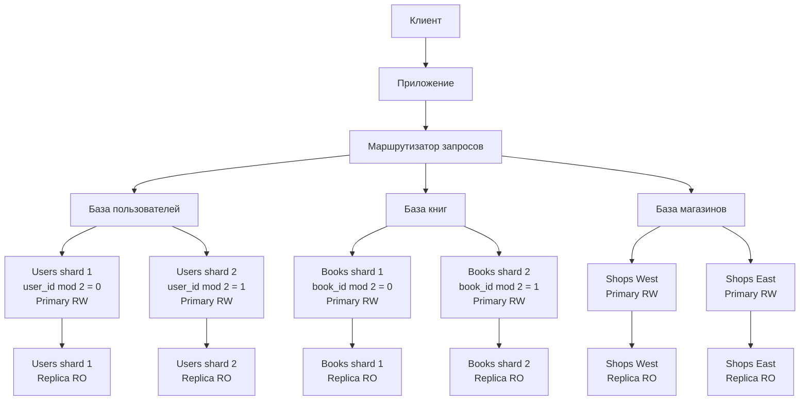

# Домашнее задание к занятию «Репликация и масштабирование. Часть 2»

---

### Задание 1

Опишите основные преимущества использования масштабирования методами:

- активный master-сервер и пассивный репликационный slave-сервер; 
- master-сервер и несколько slave-серверов;


*Дайте ответ в свободной форме.*

### Решение:

```
Активный master и пассивный slave

При использовании этой схемы основной сервер master принимает запросы на чтение и запись. Все изменения передаются на пассивный сервер slave.

Основные преимущества:

наличие актуальной копии данных;
возможность быстро заменить master при его отказе;
резервное копирование можно выполнять на slave, не нагружая основной сервер;
запросы на чтение можно частично перенести на slave;
схема относительно проста в настройке и сопровождении.

Пассивный slave обычно работает в режиме read-only. Запросы на изменение данных направляются только на master.

Главный недостаток схемы заключается в том, что при отказе master может потребоваться ручное или автоматизированное переключение приложения на slave.

Master и несколько slave-серверов

В этой схеме один master принимает запросы на изменение данных, а несколько slave-серверов получают копии изменений.

Основные преимущества:

распределение запросов на чтение между несколькими серверами;
снижение нагрузки на master;
возможность использовать отдельный slave для резервного копирования;
возможность использовать отдельный slave для аналитических запросов;
повышение отказоустойчивости;
возможность заменить отказавший master одним из slave-серверов.

Запросы INSERT, UPDATE и DELETE выполняются на master. Запросы SELECT могут распределяться между slave-серверами с помощью балансировщика нагрузки.

При этом необходимо учитывать возможную задержку репликации. Сразу после записи на master новые данные могут ещё не появиться на одном из slave-серверов.

```

---

### Задание 2


Разработайте план для выполнения горизонтального и вертикального шаринга базы данных. База данных состоит из трёх таблиц: 

- пользователи, 
- книги, 
- магазины (столбцы произвольно). 

Опишите принципы построения системы и их разграничение или разбивку между базами данных.

*Пришлите блоксхему, где и что будет располагаться. Опишите, в каких режимах будут работать сервера.* 

## Решение:

База данных содержит три основные сущности:

* пользователи;
* книги;
* магазины.

Для масштабирования предлагается использовать одновременно вертикальный и горизонтальный шардинг.

### Структура таблиц

Таблица пользователей:

```sql
CREATE TABLE users (
    user_id BIGINT PRIMARY KEY,
    full_name VARCHAR(255) NOT NULL,
    email VARCHAR(255) NOT NULL UNIQUE,
    region_id INT NOT NULL,
    created_at TIMESTAMP DEFAULT CURRENT_TIMESTAMP
);
```

Таблица книг:

```sql
CREATE TABLE books (
    book_id BIGINT PRIMARY KEY,
    title VARCHAR(255) NOT NULL,
    author VARCHAR(255) NOT NULL,
    category VARCHAR(100),
    price DECIMAL(10,2) NOT NULL
);
```

Таблица магазинов:

```sql
CREATE TABLE shops (
    shop_id BIGINT PRIMARY KEY,
    name VARCHAR(255) NOT NULL,
    region_id INT NOT NULL,
    address VARCHAR(500) NOT NULL
);
```

### Вертикальный шардинг

При вертикальном шардинге таблицы разделяются по их назначению.

| База данных | Содержимое      |
| ----------- | --------------- |
| `users_db`  | Таблица `users` |
| `books_db`  | Таблица `books` |
| `shops_db`  | Таблица `shops` |

Такое разделение позволяет независимо масштабировать разные части системы.

Например, каталог книг может получать значительно больше запросов, чем таблица магазинов. В этом случае серверы `books_db` можно масштабировать отдельно, не затрагивая пользователей и магазины.

Также вертикальный шардинг уменьшает влияние отказа одной предметной области на остальные части системы.

### Горизонтальный шардинг

После вертикального разделения данные внутри каждой базы дополнительно разбиваются по строкам.

#### Пользователи

Пользователи распределяются по значению `user_id`:

* `users_shard_1` — пользователи, у которых `user_id % 2 = 0`;
* `users_shard_2` — пользователи, у которых `user_id % 2 = 1`.

Пример определения шарда:

```text
shard_number = user_id % 2
```

#### Книги

Книги также распределяются по идентификатору:

* `books_shard_1` — книги, у которых `book_id % 2 = 0`;
* `books_shard_2` — книги, у которых `book_id % 2 = 1`.

Такой способ обеспечивает примерно равномерное распределение записей между серверами.

#### Магазины

Магазины целесообразно распределить по регионам:

* `shops_shard_west` — магазины западных регионов;
* `shops_shard_east` — магазины восточных регионов.

Разделение магазинов по регионам удобно, поскольку большинство запросов к магазинам обычно связано с местоположением пользователя.

### Маршрутизация запросов

Перед базами данных располагается маршрутизатор запросов.

Для пользователей и книг маршрутизатор вычисляет номер шарда по идентификатору:

```text
user_id % 2
book_id % 2
```

Для магазинов маршрутизатор выбирает шард по значению `region_id`.

Приложение сначала определяет предметную область, а затем выбирает конкретный горизонтальный шард.

### Режимы работы серверов

Каждый горизонтальный шард состоит из двух серверов:

* `primary` — работает в режиме `read-write`;
* `replica` — работает в режиме `read-only`.

Primary принимает запросы:

```text
INSERT
UPDATE
DELETE
SELECT
```

Replica используется для:

* выполнения запросов `SELECT`;
* распределения нагрузки на чтение;
* резервного копирования;
* переключения при отказе primary.

Изменения с primary передаются на replica с помощью репликации.

При отказе primary одна из replica может быть переведена в режим `read-write` и назначена новым primary.

### Блок-схема



### Особенности работы системы

Межтабличные запросы между разными базами и шардами выполняются на уровне приложения.

Например, для получения списка магазинов и доступных в них книг приложение может отдельно обратиться к `shops_db` и `books_db`, а затем объединить результаты.

При добавлении новых серверов количество шардов можно увеличить. При этом потребуется перераспределить часть данных и обновить правила маршрутизации.

Для хранения информации о расположении шардов можно использовать отдельную таблицу конфигурации или сервис маршрутизации.
